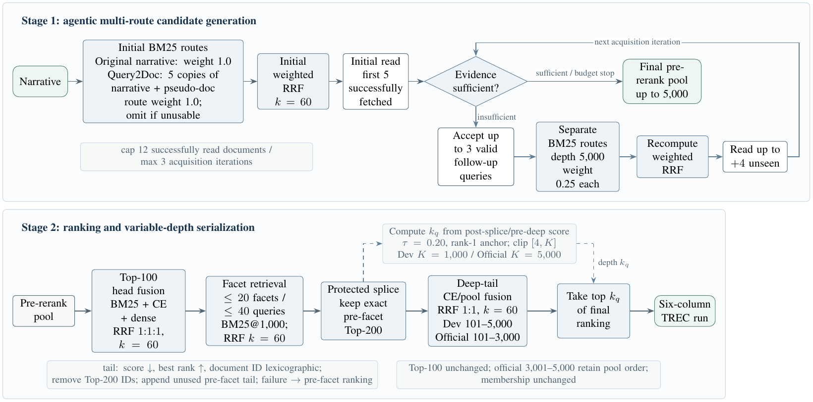
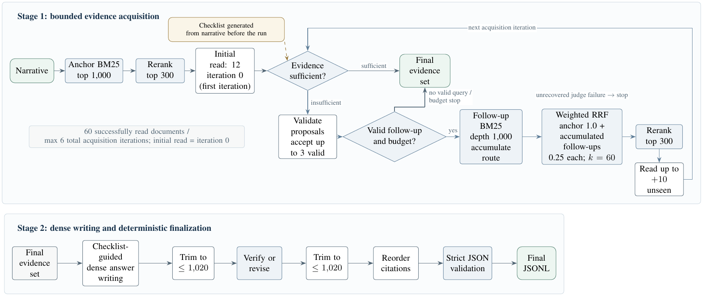

# CFDA TREC RAG 2026

**中央研究院 資訊科技創新研究中心 — 2026 年暑期實習成果**
*Summer 2026 internship project, Research Center for Information Technology
Innovation (CITI), Academia Sinica.*

CFDA's Retrieval (R) and Retrieval-Augmented Generation (RAG) system for the
TREC RAG 2026 track. The system combines multi-route retrieval, neural
reranking, iterative evidence acquisition, and citation-grounded answer
generation over the ClimbMix collection.

- **指導老師 / Advisor:** 王釧茹
- **單位 / Group:** CITI, Academia Sinica — CFDA team
- **Technical report:** [*CFDA at TREC 2026 Retrieval-Augmented Generation Track*](docs/technical_report.pdf)
- **Status:** Public implementation of the competition system. Official 2026
  test scores are organizer-run and were not available at the time of writing;
  the results below are 22-topic development-set diagnostics.

## System overview

The system contains two related pipelines:

| Pipeline  | Purpose                                                    | Output              |
| --------- | ---------------------------------------------------------- | ------------------- |
| Retrieval | Produce a variable-depth document ranking for each topic   | Six-column TREC run |
| RAG       | Acquire sufficient evidence and generate a grounded answer | TREC RAG JSONL      |

TypeScript coordinates retrieval and generation, while a local Python service
handles neural reranking, passage selection, sentence-level evidence matching,
and an authenticated Codex CLI bridge. The pipeline uses `gpt-oss-120b` for
checklist generation and the Retrieval sufficiency judge. Codex `gpt-5.6-sol`
handles Retrieval query/writer roles and the RAG controller, including its
sufficiency decisions and answer writing.

### Design summary

- **Adaptive retrieval:** an evidence-sufficiency decision determines whether
  the system stops or searches again.
- **Query diversity with drift control:** the original narrative, Query2Doc,
  and validated follow-up queries contribute through weighted RRF.
- **Protected ranking head:** later facet expansion and deep reranking improve
  coverage without destabilizing the highest-ranked documents.
- **Evidence acquisition limits:** the RAG pipeline limits acquisition to six
  iterations and 60 successfully read documents.
- **Grounded generation:** answer revision and citation ordering operate on
  retrieved evidence before strict output validation.

## Results (22-topic development set)

All numbers are development-set diagnostics measured with a local LLM judge,
not official test-set results. Retrieval is evaluated against three projected
UMBRELA qrels with a grade-2 relevance threshold and linear-gain nDCG.
Differences smaller than about three points should not be treated as real.

### Retrieval — variable-depth output with deep-tail cross-encoder reranking

| nDCG@10 | Recall@submitted-k | P@10   | MAP    | MRR    |
| ------: | -----------------: | -----: | -----: | -----: |
| 0.7456  | 0.2343             | 0.9076 | 0.1432 | 0.9848 |

The submitted run is variable-depth: 20 of the 22 development narratives
receive fewer than 1,000 documents, with a mean depth of 601.45, a median of
687.5, and 18 distinct depths. A fixed top-1000 output (Recall@1000 = 0.3159)
is retained only as a backup comparison.

Official submission: two Retrieval runs, `cfda-vfs-deep` (priority 1) and
`cfda-vfs-unc` (priority 2, pre-deep-tail configuration).

### RAG — bounded evidence acquisition with citation-aware dense writing

| V_strict | A      | Full support | No support |
| -------: | -----: | -----------: | ---------: |
| 0.4656   | 0.5298 | 97.0%        | 0.1%       |

`V_strict` is strict coverage over vital nuggets; `A` is coverage over all
nuggets; full/no support are the shares of judged sentence-citation pairs.
The selected configuration reads 12 documents initially and up to 10 unseen
documents per round (six rounds, 60 documents maximum). The selected output
has 22 valid completed topics, 12-30 references and 44-71 answer objects per
topic, and a mean answer length of 976.73 words (maximum 1,019).

Official submission: one RAG run, `cfda-w5c` (priority 1).

## Architecture

Two cooperating processes.

**Sidecar** (`sidecar/src/sidecar.py`, Python, port 8765) owns everything that
needs a local model or an external CLI. It binds only to `127.0.0.1`.

| Endpoint            | Purpose                                                          |
| ------------------- | --------------------------------------------------------------- |
| `/rerank`           | MiniLM cross-encoder rerank fused 1:1 with the incoming BM25 rank |
| `/passages`         | narrative-relevant passage selection from a full document        |
| `/sentence_evidence`| supporting excerpts and support-strength scores per answer sentence |
| `/aspect_coverage`  | semantic checklist-coverage check for gap filling                |
| `/llm`              | isolated, tool-disabled Codex CLI bridge used by the RAG launcher |

**Runner** (TypeScript, under `code/src/trec-rag-2026/`) is the per-topic
control loop: multi-route BM25 search, weighted RRF fusion, reranking,
iterative document reading with an LLM sufficiency judge, dense answer
generation, per-sentence verification, and citation ordering.

The split keeps the control loop thin and deterministic while isolating all
model-specific work behind one HTTP contract.

## Retrieval pipeline



For each narrative, the Retrieval pipeline:

1. Runs an anchor BM25 search using the original narrative.
2. Generates one Query2Doc pseudo-document and runs one expanded BM25 search.
   Within this expanded query, the original narrative has a repeat/boost factor
   of 5 to reduce query drift. This is separate from its RRF route weight,
   which remains 1.
3. Fuses the anchor and Query2Doc rankings with weighted reciprocal rank fusion
   (RRF, `k=60`).
4. Reads ranked evidence and asks an LLM whether the evidence is sufficient.
   If not, it validates up to three follow-up BM25 queries, assigns each a
   fusion weight of `0.25`, recomputes RRF, and continues within the configured
   document and iteration budgets.
5. Reranks the top 100 using BM25, cross-encoder, and dense signals with
   `1:1:1` RRF fusion.
6. Retrieves facet queries and splices their pool below a protected top 200.
7. Optionally applies deep cross-encoder reranking to ranks 101-3,000 while
   preserving the top 100.
8. Computes each topic's output depth from the pre-deep scores (`tau=0.20`) and
   writes a six-column TREC run.

The Retrieval configuration is defined in
[`code/config/final_pipeline.ts`](code/config/final_pipeline.ts).
Its sufficiency judge uses `gpt-oss-120b`; query-generation and writer roles use
`gpt-5.6-sol` through the authenticated local Codex sidecar.

## RAG pipeline



For each narrative, the RAG pipeline:

1. Retrieves BM25 top 1,000 and reranks the top 300.
2. Initially reads 12 documents.
3. Uses a checklist generated from the narrative, together with the evidence
   read so far, to decide whether more retrieval is needed.
4. When evidence is insufficient, validates up to three follow-up queries. If
   a valid query and budget remain, it performs BM25 retrieval, weighted RRF,
   top-300 reranking, and reads 10 previously unseen documents.
5. Repeats until evidence is sufficient, no valid continuation remains, six
   rounds are reached, or 60 documents have been read.
6. Uses the final evidence and checklist to generate a dense cited answer.
7. Trims to 1,020 words, verifies or weakens unsupported claims, trims again,
   orders citations by support strength, and validates the JSON structure. The
   1,020-word internal cap leaves headroom below the organizer limit of 1,024.
8. Applies deterministic finalization and checks formatting, identifiers, and
   topic completeness before writing the submission file.

## Repository layout

```text
CFDA_TREC_RAG_2026/
├── README.md
├── requirements.in                direct Python dependencies
├── requirements.lock              resolved Python 3.12 environment
├── examples/                       minimal format examples
├── docs/
│   ├── figures/                    pipeline diagrams used in this README
│   └── technical_report.pdf        CFDA team technical report
├── .github/workflows/ci.yml        automated checks
├── code/
│   ├── config/final_pipeline.ts    Retrieval configuration
│   ├── scripts/                    public run/build/validation entry points
│   ├── src/llm/                    model-service, Codex, and optional OpenAI clients
│   ├── src/evaluation/             local qrels discovery and metrics
│   ├── src/trec-rag-2026/
│   │   ├── retrieval-pipeline/     Retrieval controller
│   │   ├── rag-pipeline/           RAG controller
│   │   ├── retrieval/              retrieval and reranking components
│   │   └── shared-rag/             shared prompts, contracts, and validation
│   ├── tools/                      checklist, deep rerank, finalization, checks
│   └── tests/                      deterministic offline smoke tests
└── sidecar/
    ├── src/sidecar.py              localhost HTTP service
    └── README.md                   endpoint and configuration details
```

## Quickstart: offline validation

Prerequisites: Node.js 22 or newer, Python 3.12, and npm.

The public code paths can be checked without API keys, a GPU, model downloads,
or competition data:

```bash
cd code
npm ci
npm run check
```

This runs formatting and type checks, unit tests, and mocked end-to-end tests
for one Retrieval topic and one RAG topic. A successful run ends with all
TypeScript and Python tests passing. It does not contact ClimbMix or external
model APIs, and it does not exercise GPU inference. GitHub Actions runs the
same checks.

## Requirements

- Node.js 22 or newer
- Python 3.12
- Access to the ClimbMix/Pyserini service
- API credentials for the `gpt-oss-120b` service
- An authenticated Codex CLI session for Retrieval query/writer roles and the
  RAG pipeline (the bridge is tested with Codex CLI 0.146.0)
- A CUDA-capable GPU is recommended for neural reranking

## Installation

From the repository root, install the locked TypeScript dependencies:

```bash
cd code
npm ci
cd ..
```

Create a Python environment and install the pinned reranking and sidecar
dependencies:

```bash
python3 -m venv .venv
source .venv/bin/activate
python -m pip install --requirement requirements.lock
```

## Configuration

Copy the example environment files. The resulting `.env.local` files are
ignored by Git and must not be committed.

```bash
cp code/.env.example code/.env.local
cp sidecar/.env.local.example sidecar/.env.local
```

Configure:

| File                 | Required values                      |
| -------------------- | ------------------------------------ |
| `code/.env.local`    | `NCHC_API_KEY`, `PYSERINI_API_TOKEN` |
| `sidecar/.env.local` | `PYSERINI_API_TOKEN`, `NCHC_API_KEY` |

`SIDECAR_URL` defaults to `http://127.0.0.1:8765`. The server port can be
changed with `SIDECAR_PORT`; use matching values when changing it.

### Codex authentication for query and generation roles

The Retrieval and RAG pipelines send query-planning and answer-writing calls to
the local sidecar, which invokes Codex CLI. Authenticate Codex on the machine
running the service:

```bash
npm install --global @openai/codex
codex login
codex login status
```

On a headless server, use `codex login --device-auth`. API-key authentication
is also available through `codex login --with-api-key`.

## Official data

This repository does not redistribute the TREC RAG datasets. Download data
from the [official TREC-RAG data repository](https://github.com/TREC-RAG/trec-rag-data):

- [2026 test data](https://github.com/TREC-RAG/trec-rag-data/tree/main/trec-rag-2026/test-data),
  including `trec_rag_2026_queries.tsv`;
- [development data](https://github.com/TREC-RAG/trec-rag-data/tree/main/trec-rag-2026/development-data),
  including development topics and projected UMBRELA qrels.

The development qrels are model-generated diagnostics for development topics;
they are not official judgments for the 119 test topics.

## Input files

Topics are required. The normal RAG launcher derives its checklist from those
topics automatically. Qrels are optional and are used only for development
diagnostics. Minimal example files are included for format validation.

### Topics TSV

One topic per line, with the exact topic ID and narrative separated by a tab:

```text
topic_id<TAB>narrative
```

See [`examples/topics.example.tsv`](examples/topics.example.tsv).

### Optional qrels directory

Provide a directory containing one or more `*.qrels` files to calculate local
diagnostic metrics. Qrels never affect query generation, retrieval, evidence
selection, or answer writing, and normal runs do not require them.

### Narrative checklist

Before retrieval, the RAG launcher generates a checklist from each narrative.
It guides the sufficiency check, follow-up queries, and answer structure. Each
run stores the checklist as `generated-checklist.jsonl` in its output directory.

The generator emits only aspect titles and vital/okay priorities. It does not
predict facts before retrieval; factual claims must come from ClimbMix evidence
collected during the run.

One generated JSON object per topic:

```json
{ "qid": "topic_id", "items": ["first aspect", "second aspect"] }
```

See [`examples/checklist.example.jsonl`](examples/checklist.example.jsonl).
To generate a checklist separately for inspection:

```bash
python code/tools/build_checklist.py \
  --topics /path/to/topics.tsv \
  --output /path/to/checklist.jsonl
```

Example Retrieval and RAG output files are available in
[`examples/retrieval_output.example.tsv`](examples/retrieval_output.example.tsv)
and [`examples/rag_output.example.jsonl`](examples/rag_output.example.jsonl).
They demonstrate the required formats, contain placeholder data, and are not
competition submissions.

## Start the local neural service

The RAG pipeline calls a small local Python service (the `sidecar`) for neural
reranking and evidence processing. Start it in a separate terminal from the
repository root:

```bash
source .venv/bin/activate
cd sidecar
python -m src.sidecar
```

It binds only to `127.0.0.1`. At startup it loads or downloads the configured
reranking model into an ignored local cache.

### Codex bridge trust boundary

Retrieved document text is untrusted input. The `/llm` bridge starts every
Codex request in a new empty workspace, removes pipeline credentials from the
child environment, disables optional tool surfaces, ignores user configuration
and rules, and uses an ephemeral read-only session with approvals disabled.
Strict configuration validation makes an unsupported flag or feature name fail
before the request runs.

The bridge still relies on the host's authenticated Codex session. Run the
sidecar only on a trusted machine, keep it bound to `127.0.0.1`, and never
expose port 8765 to other hosts. For stronger multi-tenant isolation, replace
the bridge with a model API call that does not provide tools or run it inside a
container that has no project, credential, or cache mounts.

## Run the Retrieval pipeline

### 1. Generate the candidate pool

```bash
cd code
npm run run:retrieval -- \
  --run-id example-retrieval \
  --team-id example-team \
  --output-dir out/example-retrieval \
  --topics /path/to/topics.tsv
```

Keep the local sidecar running during this stage. The pipeline uses it for
Codex-backed query-generation and writer roles; no direct OpenAI API key is
required.

Add `--qrels-dir /path/to/development-qrels` only when diagnostic metrics are
required.

The wrapper loads `code/.env.local`. A topic failure makes the command return
non-zero after writing `validation.json` and `failed_topics.json`; an incomplete
run must not proceed to submission building.

The main candidate pool is written to:

```text
code/out/example-retrieval/candidate_pool_top5000.trec
```

### 2. Run deep-tail reranking

```bash
source ../.venv/bin/activate
python tools/deep_ce_rerank.py out/example-retrieval \
  --head 100 \
  --depth 3000 \
  --variant 'RRF 1:1' \
  --device auto \
  --out out/example-retrieval/deepce
```

The deep-tail stage reads the shared document cache and fetches any uncached
rank-101--3,000 documents from the configured ClimbMix API before scoring.
It refuses to write an output when more than 1% of the requested document text
remains unavailable. Fetch concurrency, pacing, and the safety threshold are
configurable with `--fetch-workers`, `--fetch-pace`, and
`--max-missing-fraction`.

### 3. Build the two Retrieval outputs

```bash
RUN_DIR="$PWD/out/example-retrieval" \
TOPICS=/path/to/topics.tsv \
UNC_TAG=example-retrieval-unc \
DEEP_TAG=example-retrieval-deep \
bash scripts/build_retrieval_submissions.sh
```

Default outputs:

```text
code/out/retrieval-submissions/example-retrieval-unc/r_output_trec_rag_2026.tsv
code/out/retrieval-submissions/example-retrieval-deep/r_output_trec_rag_2026.tsv
```

## Run the RAG pipeline

Keep the sidecar running, then use another terminal:

```bash
cd code
TOPICS=/path/to/topics.tsv \
SIDECAR_URLS=http://127.0.0.1:8765 \
RUN_ID=example-rag \
TEAM_ID=example-team \
npm run run:rag
```

By default, this command generates the checklist from `TOPICS` using
`gpt-oss-120b` before evidence acquisition begins. Set `CHECKLIST_MODEL` to a
compatible alternative model. Ordinary runs should not supply a checklist.

Set `QRELS_DIR=/path/to/development-qrels` to enable optional diagnostic
metrics.

The launcher uses four shards by default, resumes completed topics, performs a
final completeness pass without weakening the answer-quality gate, applies
deterministic finalization, and validates the final JSONL against the complete
topics file. Any missing, duplicated, or extra topic makes the command fail.

Default final output:

```text
code/out/submissions/example-rag/rag_output_trec_rag_2026.jsonl
```

Optional environment variables:

| Variable            | Purpose                                                               |
| ------------------- | --------------------------------------------------------------------- |
| `OUT`               | Raw RAG run directory                                                 |
| `SUBMISSION_OUT`    | Finalized submission directory; defaults to `out/submissions/$RUN_ID` |
| `SHARDS`            | Number of parallel topic shards; default `4`                          |
| `SIDECAR_URLS`      | Comma-separated sidecar URLs                                          |
| `CHECKLIST_MODEL`   | Model used to generate narrative checklists; default `gpt-oss-120b`   |
| `PYSERINI_TOKENS`   | Comma-separated tokens assigned across shards                         |
| `QRELS_DIR`         | Optional directory of development qrels                               |
| `RUN_ID`, `TEAM_ID` | Run and team identifiers written to generated records                 |

`CHECKLIST_REPLAY=/path/to/checklist.jsonl` is available only when explicitly
replaying a previously generated checklist; normal runs regenerate it from the
topics file.

## Validation and tests

The Quickstart command runs the same deterministic offline checks used by
GitHub Actions. CI does not contact external services, download models, run GPU
inference, or reproduce a full competition run.

Validate generated Retrieval and RAG files together:

```bash
code/scripts/validate_outputs.sh \
  /path/to/retrieval.tsv \
  /path/to/rag.jsonl \
  /path/to/topics.tsv
```

Scan a generated output directory for configured secret values before sharing
it:

```bash
code/scripts/check_no_secret_leak.sh /path/to/output-directory
```

## Reproducibility

This repository reproduces the pipeline structure, configuration,
serialization, and validation procedure. External service state and model
responses may prevent byte-identical reproduction of a previous run.

- Node dependencies are locked by `code/package-lock.json`.
- Sidecar and deep-reranker dependencies are resolved together in
  `requirements.lock` for CPython 3.12 on Linux x86-64.
- Model weights come from their upstream registries.
- Competition services and inputs require separate authorization.
- Generated outputs, caches, traces, and intermediate pools remain untracked.

## Troubleshooting

- **Local neural service is unreachable:** start it from `sidecar/` and check
  `http://127.0.0.1:8765/health`; keep `SIDECAR_PORT` and `SIDECAR_URLS`
  consistent.
- **Authentication fails:** verify `PYSERINI_API_TOKEN` and `NCHC_API_KEY` in
  the appropriate untracked `.env.local` file, then run `codex login status`
  on the machine hosting the sidecar.
- **Model loading or CUDA fails:** confirm available GPU memory, or run the
  deep reranker with `--device auto` for automatic device selection.

## Credits

This is the CFDA team system for the TREC RAG 2026 track, developed during a
summer 2026 internship at the Research Center for Information Technology
Innovation (CITI), Academia Sinica, under the supervision of 王釧茹. The design
and development results are described in the team technical report,
[*CFDA at TREC 2026 Retrieval-Augmented Generation Track*](docs/technical_report.pdf)
(P.-J. Hsieh, S.-H. Wu, Y.-C. Hsiao, J.-K. Tsao, H.-W. Chen, L.-Y. Chang,
M.-F. Tsai, C.-J. Wang).

## License

Apache License 2.0. See [`LICENSE`](LICENSE).
